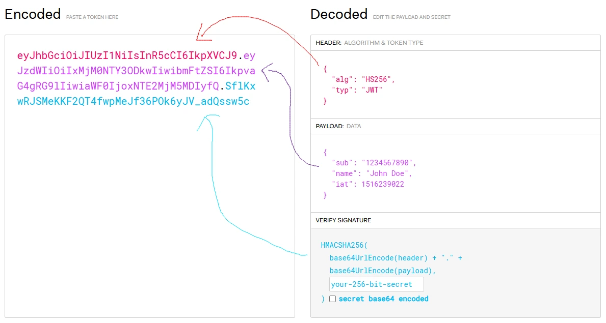
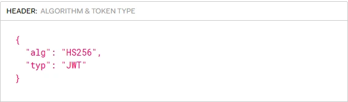
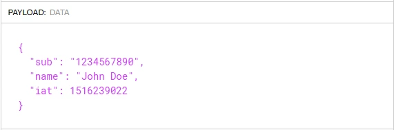
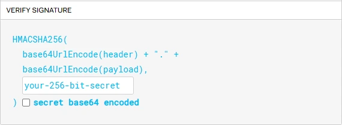

## 📌배경

​
JWT는 웹 개발에서 인증방식으로 많이 사용하는 방식으로 웹 개발자라면 해당 토큰에 대해 알고 있어야 한다. 중요한 사항인 만큼 포스팅으로 한번 정리하는 시간을 가지려고 한다.
​

## 📌구조

​
JWT는 Header, Payload, Signature 로 구성되어 있고 각 영역마다 특정내용이 담겨있다. token은 보통 아래와 같이 생겼으며 각영역은 . (맞침표) 로 구분되어 있다.
​

{/*  */}

### ➕Header

​
헤더에는 보통 서명 암호화에 사용된 알고리즘과 해당 token의 타입이 기재되어 있다. Header는 base64 encoding 되어 jwt token에 담긴다.
​

{/* ​ */}

### ➕Payload

payload 영역에는 원하는 내용을 넣어 사용하면 된다. 보통 인증을 위해 필요한 데이터를 담는 경우가 많다. 그러나 해당 payload는 단순히 base64 decoding을 통해 해당 내용을 알 수 있으니 민감한 정보는 넣지 않아야 한다. iat ( issued at ) 발급날짜 , iss(issuer), exp (expedition time ) 등을 payload에 기재 될 수 있다. payload는 base64 encoding 되어 jwt token에 담긴다.
​

{/* ​​ */}

#### ➕Signature

Signature 즉 서명은 이 토큰이 진짜인지를 판별하는 역할을 해준다. 이게 어떻게 가능할까? 서명은 header, payload 정보에 더불어 secret key를 이용해서 만들어지고 이 secret key는 서버단에서 private하게 관리하기 때문이다. 예를 들어 해커가 payload에 담긴 정보를 수정한 뒤 이를 서버로 보냈다고 가정하면 서버에서 signature를 decoding 했을 때 나오는 payload와 token으로 받은 payload가 불일치 하므로 토큰이 위조됨을 알 수 있다.
​

## 📌사용

​
보통 실무에서 JWT를 사용할 때 accessToken과 refreshToken을 발급하여 사용한다. access 토큰은 만료기간을 짧게 가져가고 고 refresh 토큰은 만료기간을 길게 가져간다. access 토큰이 만료되었을 때 refresh 토큰을 이용해 새로 access 토큰을 발급하는 방식으로 refresh 토큰을 사용하며 access 토큰은 서버에 특정 요청을 할 때 인증하기 위한 수단으로 사용된다.
​
하나의 예시로 refresh 토큰은 httpOnly 로 설정되어 쿠키에 담기고 access 토큰은 프론트단 JS 인메모리에 저장되어 서버로 요청시 해당 액세스 토큰을 authoriztion에 담아 보내는 방식으로 사용 될 수 있다. 만약 액세스토큰인 만료되었다면 서버에서 쿠키에 담긴 리프레시 토큰을 이용하여 새로운 액세스토큰을 발급하는 형태로 계속 인증상태를 유지할 수 있다.
​

## 📌세션 기반 인증과의 비교

​
JWT와 항상 함께 비교되는 인증방식으로 세션이 있다. 세션방식은 사용자의 정보를 서버측에서 저장하고 클라이언트에는 서버에서 발급한 세션id만 쿠키에 저장되는 형태로 동작한다. 사용자의 인증정보를 서버에 저장하고 요청이 들어왔을 시 세션id를 검증하고 해당 세션id에 해당하는 정보를 불러와야 하기에 jwt인증 방식 대비 서버부하가 생길 수 있다. 하지만 모든 사용자정보가 서버에서 관리되기 때문에 보안 측면에서는 jwt보다 뛰어나다.
​

## 💡참고

​
[JSON Web Tokens](https://jwt.io/)
​
{/* [JSON Web Tokens - jwt.io](https://jwt.io/) */}
